# Mermaid Diagram Showcase

A fixture for testing **C++ Modern v3 Diagrams** against the full range of Mermaid diagram types used in technical documentation.

> **Note:** Diagrams render in **Markdown Preview Enhanced (MPE)** only. The browser workbench shows ```mermaid blocks as source code.

## Setup (MPE)

1. Paste [`themes/mpe/global-cpp-modern-v3-diagrams.less`](../themes/mpe/global-cpp-modern-v3-diagrams.less) into `%USERPROFILE%\.crossnote\style.less`.
2. Add to `settings.json`:

```json
{
  "markdown-preview-enhanced.previewTheme": "none.css",
  "markdown-preview-enhanced.mermaidTheme": "default"
}
```

Use `"default"`, not `"dark"` — the dark Mermaid CSS often restores light-gray edge-label backgrounds.

3. Open **Markdown Preview Enhanced: Open Config Script (Global)** — this opens `%USERPROFILE%\.crossnote\config.js`.
4. Inside `mermaidConfig`, keep `"startOnLoad": false` and merge in every field from [`themes/mpe/mermaid-config-cpp-modern.json`](../themes/mpe/mermaid-config-cpp-modern.json) (`theme`, `themeVariables`, `flowchart`, …). That JSON is the **contents** of `mermaidConfig`, not a replacement for the whole `config.js`.
5. Save `config.js` and refresh the MPE preview.

Full copy-paste example and troubleshooting: [themes/mpe/README.md — Configure Mermaid](../themes/mpe/README.md#configure-mermaid-open-config-script).

For the light variant use `global-cpp-modern-v3-diagrams-light.less` and set `"darkMode": false` in `themeVariables`.

---

## Flowchart (CI Pipeline)

Build, test, and deploy pipeline for the taskflow service.

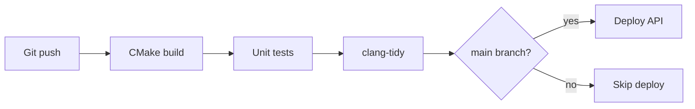

## Flowchart with Subgraphs (Layered Architecture)

Three-tier layout: HTTP API, domain services, and PostgreSQL persistence.

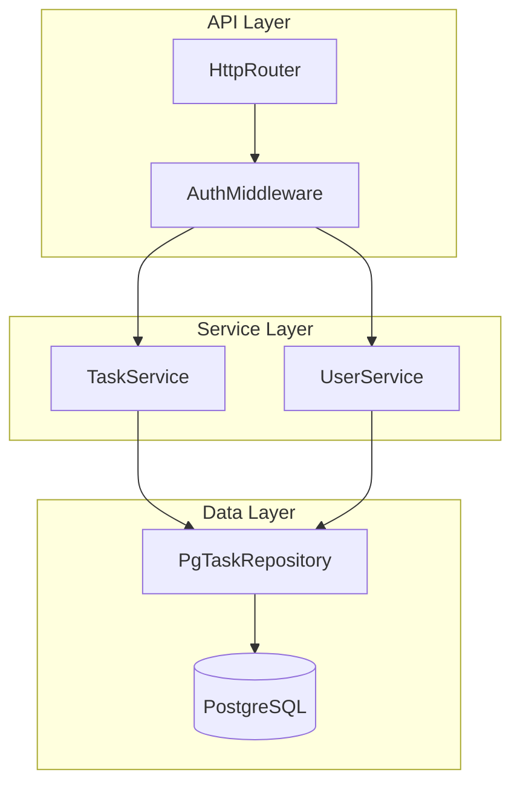

## Sequence Diagram (REST API)

Same scenario as the ASCII sequence in `documentation-patterns.md`.

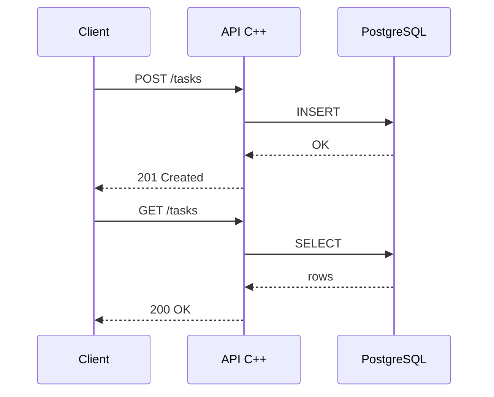

## Class Diagram (Domain Model)

Core types from the taskflow C++ codebase.

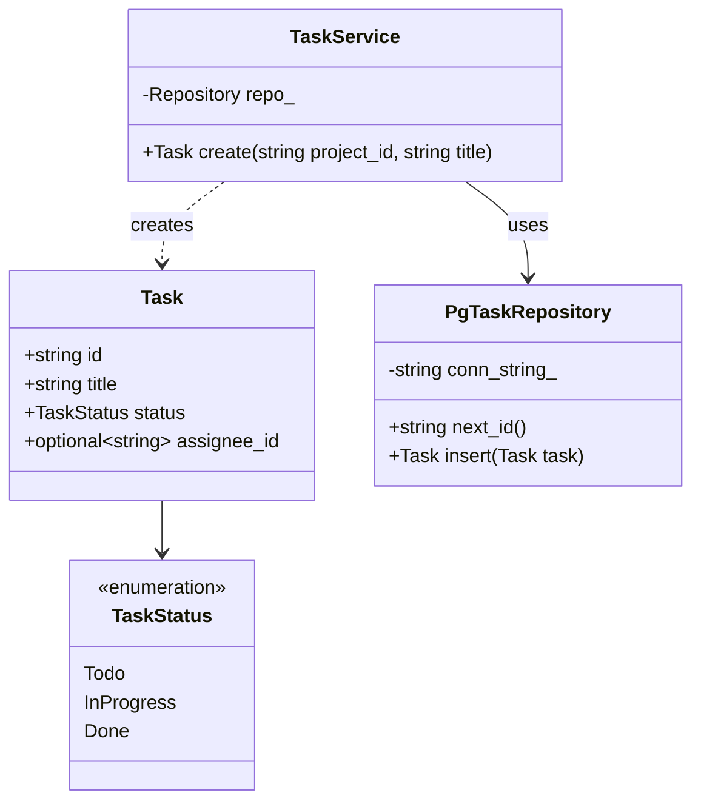

## State Diagram (Task Lifecycle)

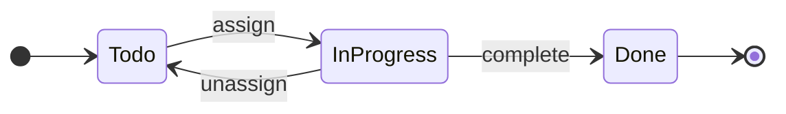

## Entity-Relationship Diagram

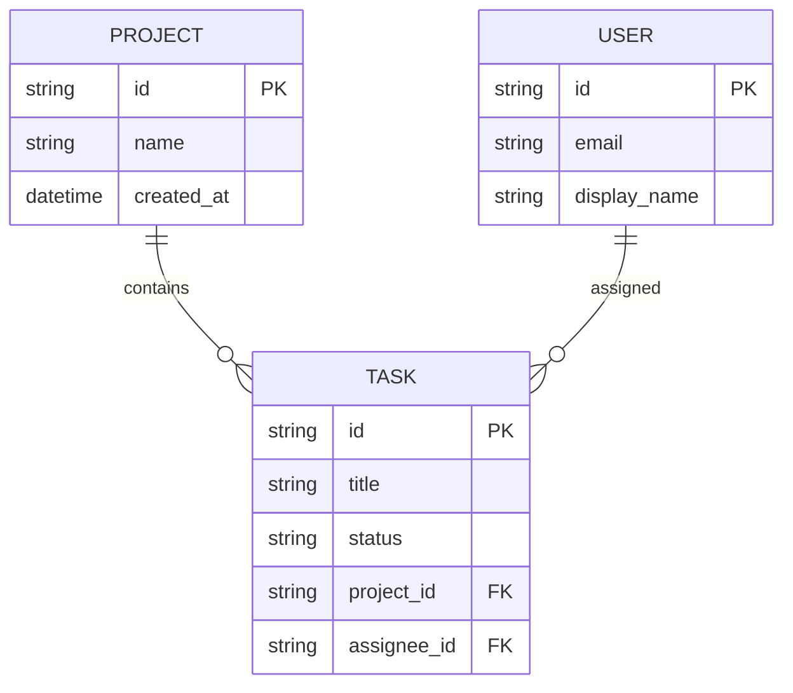

## Gantt Chart (MVP Phases)

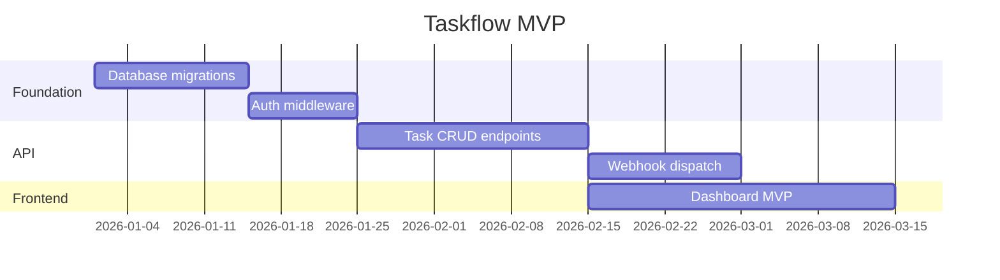

## Pie Chart (Task Status Distribution)

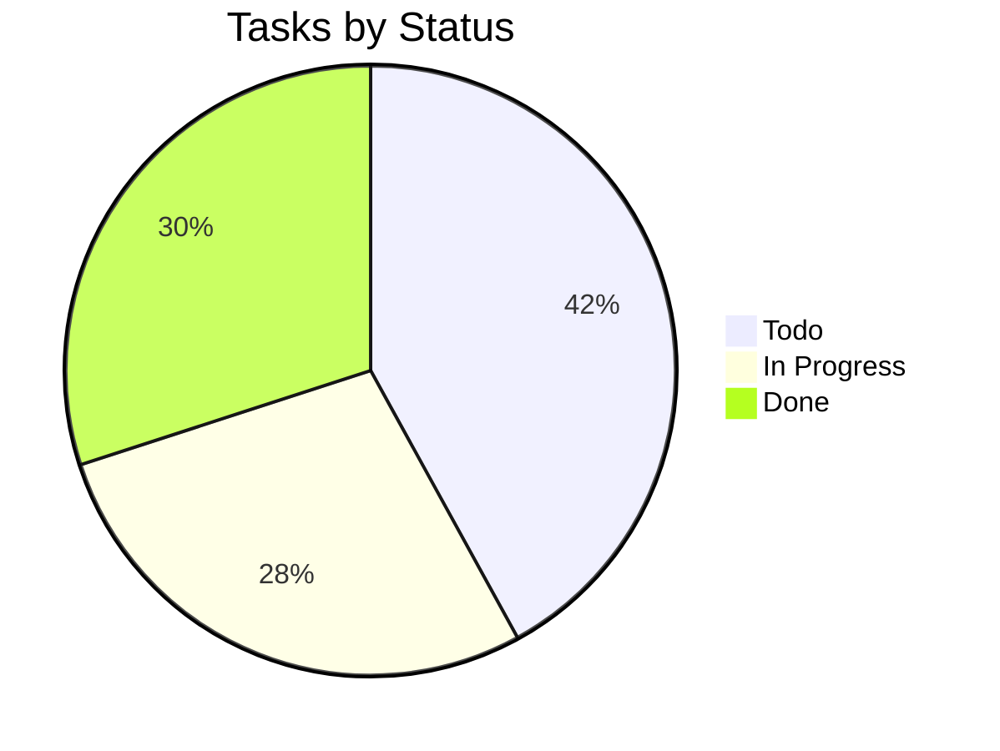

## Git Graph (Feature Branch)

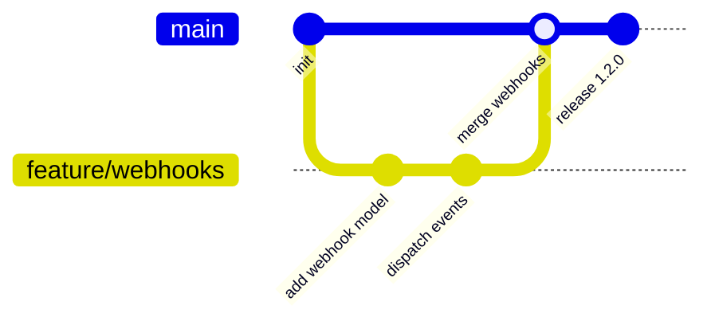

## User Journey (Onboarding)

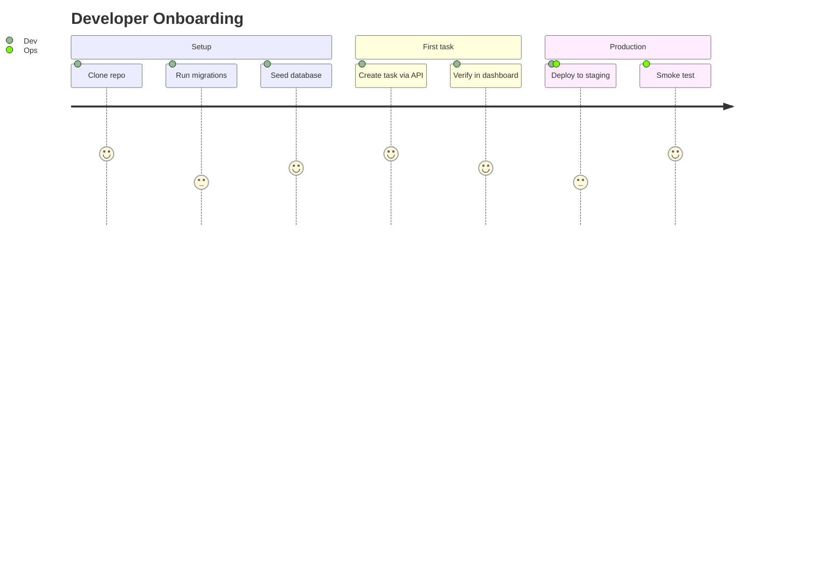

## Mindmap (Documentation Structure)

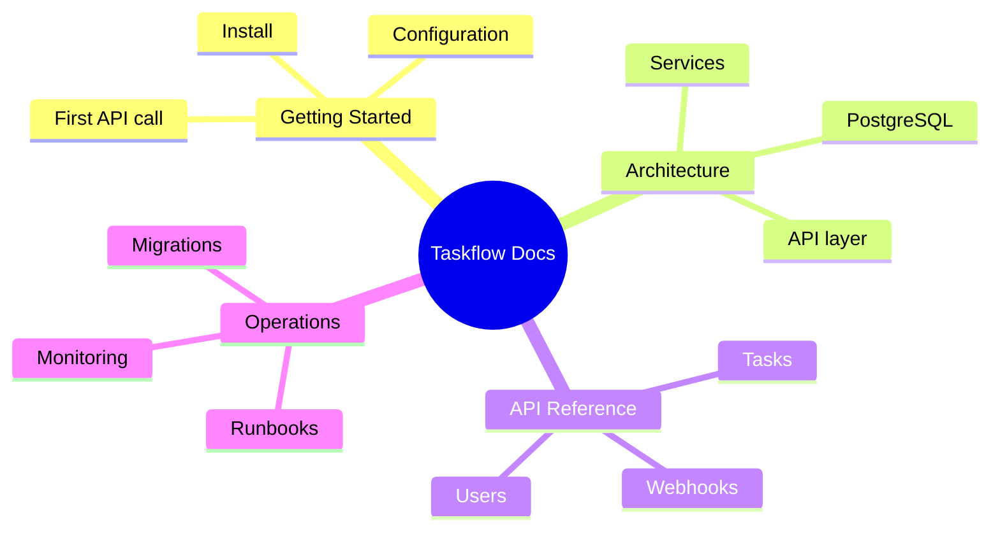

## Quadrant Chart (Backlog Prioritization)

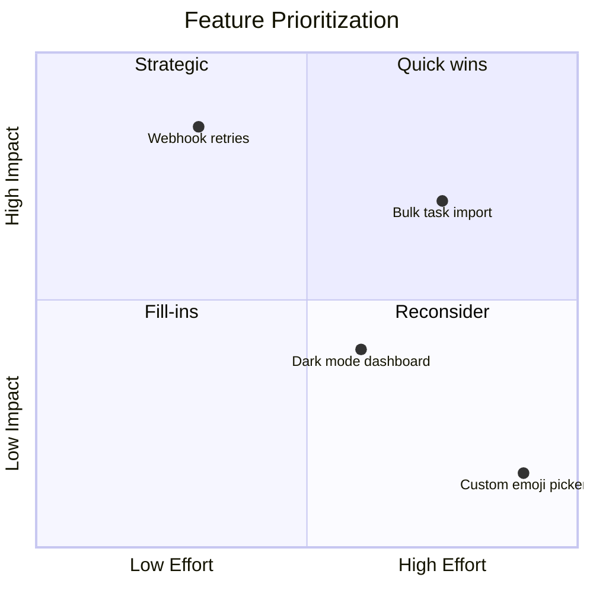

## Block Diagram (Module Layout)

Requires a recent MPE / Mermaid version. If the diagram fails to render, update the extension.

Vertical layout avoids overlapping connectors in narrow preview panes.

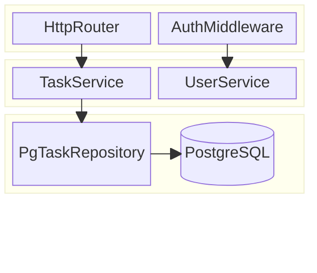

## Frontmatter Theme Variables (Optional)

Per-diagram `themeVariables` support depends on your MPE / Mermaid version. Use only if the block below renders correctly.

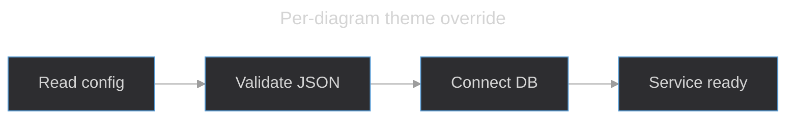
